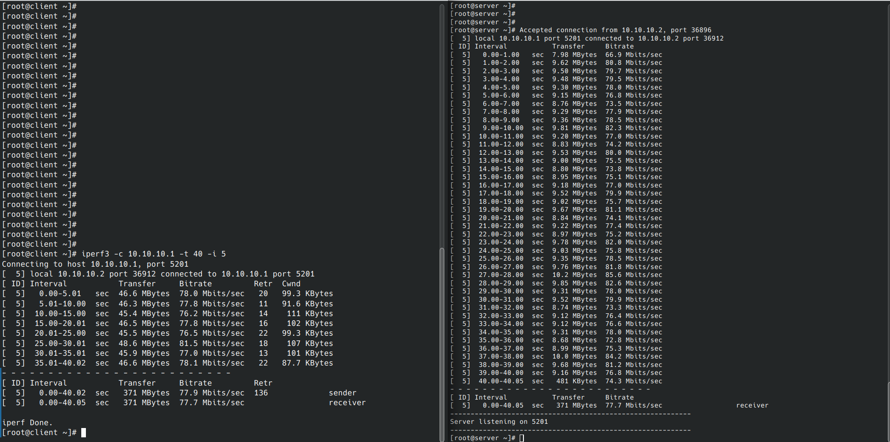
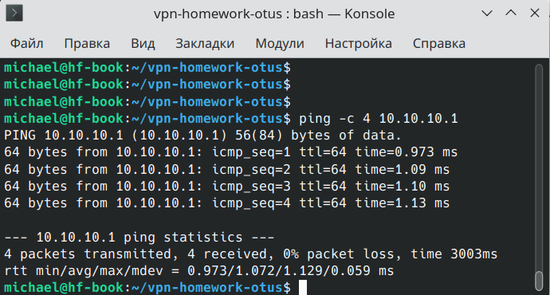

# Домашнее задание: VPN

В плейбуке размещены роли, подключаемые через playbook.yml<br>
<br>
common - общая настройка для машин server и client, используемая в обоих заданиях<br>
<br>
ovpn_client и ovpn_server подключаются для задания 1 на соответствующие хосты<br>
<br>
ras_ovpn подключается на server в задании 2<br>
<br>


<h2>1. TUN/TAP режимы VPN</h2>

Выбор типа интерфейса tun / tap устанавливается переменной <b>tun_or_tap</b>, расположенной в <b>ansible/defaults/main.yml</b>

tun -виртуальный интерфейс работает на L3
поддерживает любой вариант подключения по количеству подключенных
не позволяет использовать OSPF и другие протоколы динамической маршрутизации (link-state)
лучше использовать iBGP

tap - виртуальный интерфейс, работает на L2
по сути выполняет функционал бриджа между роутерами

<h3>для замеров скорости туннеля используется iperf3</h3>

на сервере:

```bash
iperf3 -s &
```
на клиенте:

```bash
iperf3 -c 10.10.10.1 -t 40 -i 5
```

результаты для tap режима
</img>
<br>
<br>
результаты для tun режима
</img>
<br>

<h2>2. RAS на базе OpenVPN</h2>
<br>
Подключение хоста к серверу производится из каталога ovpn_files_for_host командой:

```bash
openvpn --config client.conf
```


<br>
проверяем пинг по внутреннему IP адресу
сервера в туннеле<br>

</img>
<br>
проверяем командой ip r (netstat -rn) на хостовой машине
что сеть туннеля импортирована в таблицу маршрутизации<br>
</img>
